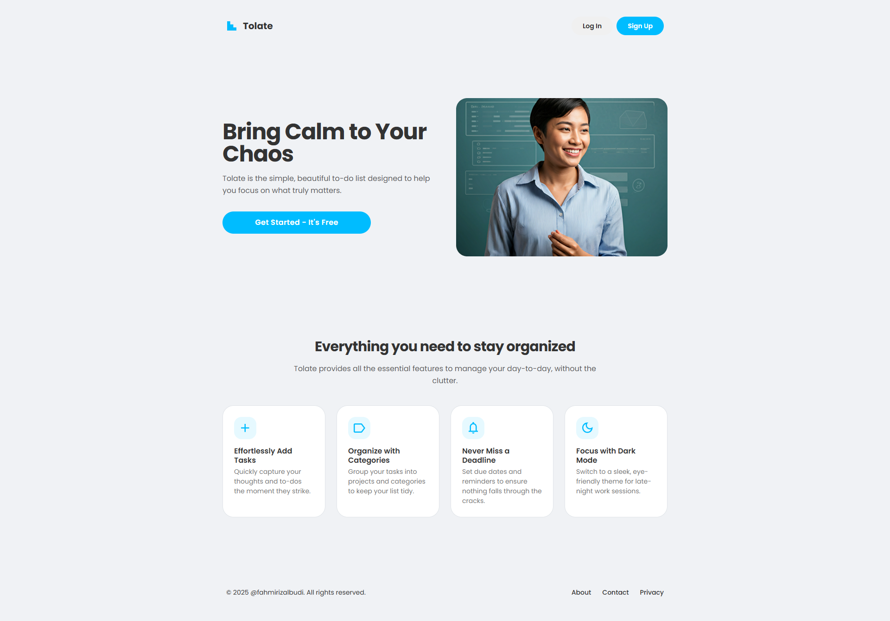

<div align="center">
<a href="https://github.com/fahmirizalbudi/tolate" target="blank">

</a>
<br/>

<br />
<br />


</div>

<br />

## 🌐 Tolate

Tolate is a todo list landing web application. Built on Vue. Key features include:

## 🖼️ Preview



## ✨ Features

- **💚 Powered by Vue:** Built using the progressive JavaScript framework.
- **🎨 Modern UI/UX:** Clean and aesthetic design implemented.

## 👩‍💻 Tech Stack

- **Vue.js**: The Progressive JavaScript Framework used for building the user interface and handling application logic.

## 📦 Getting Started

To get a local copy of this project up and running, follow these steps.

### 🚀 Prerequisites

- **Node.js** & **NPM**.

## 🛠️ Installation

1. **Clone the repository:**

   ```bash
   git clone https://github.com/fahmirizalbudi/tolate.git
   cd tolate
   ```

2. **Install dependencies:**

   ```bash
   npm install
   ```

3. **Start the development server:**

   ```bash
   npm run dev
   ```

## 📖 Usage

### ✔ Running the Application

- **Development mode:** `npm run dev`.
- **Production mode:** `npm run build`.

> Open [http://localhost:5173](http://localhost:5173) to view it in the browser.

## 📜 License

All rights reserved. This project is for educational purposes only and cannot be used or distributed without permission.
